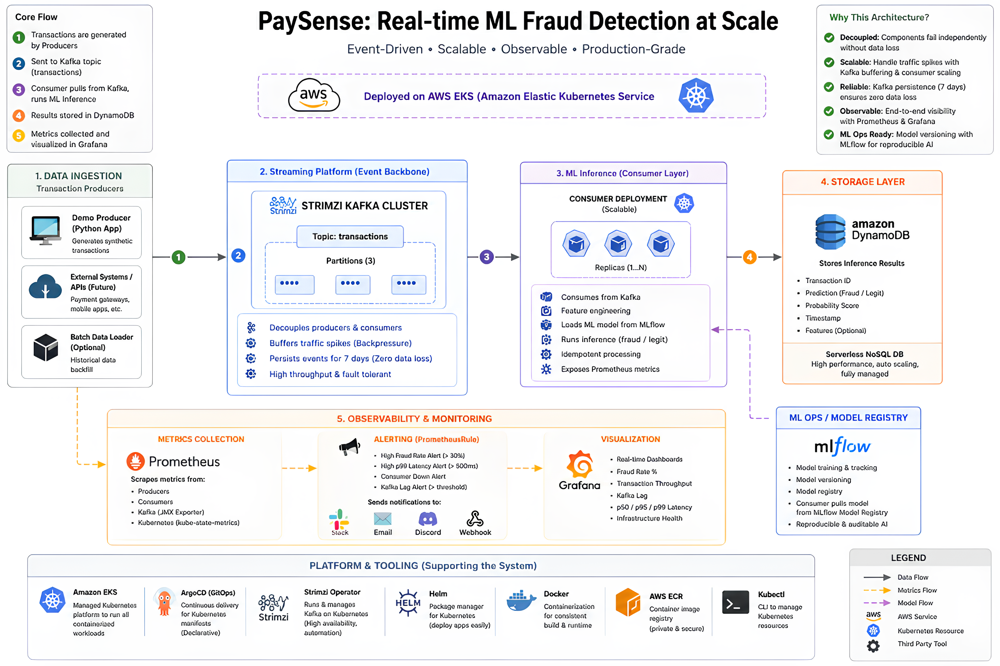
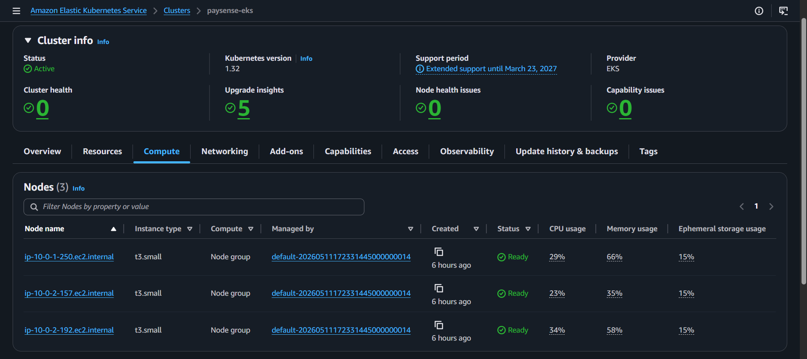
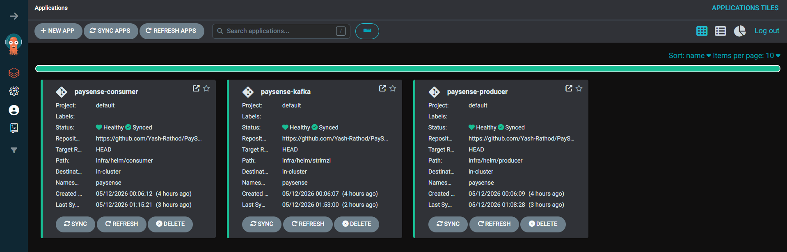
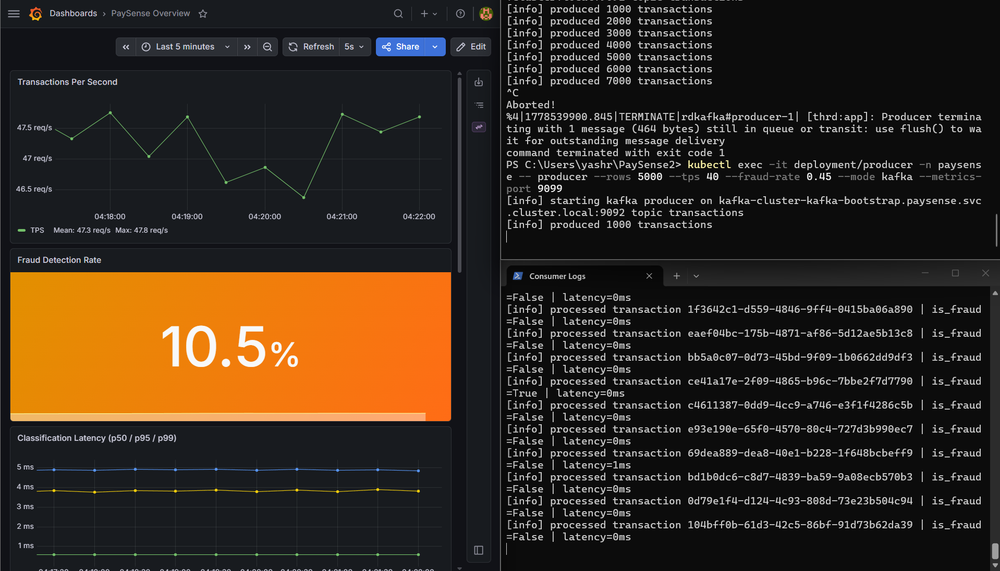
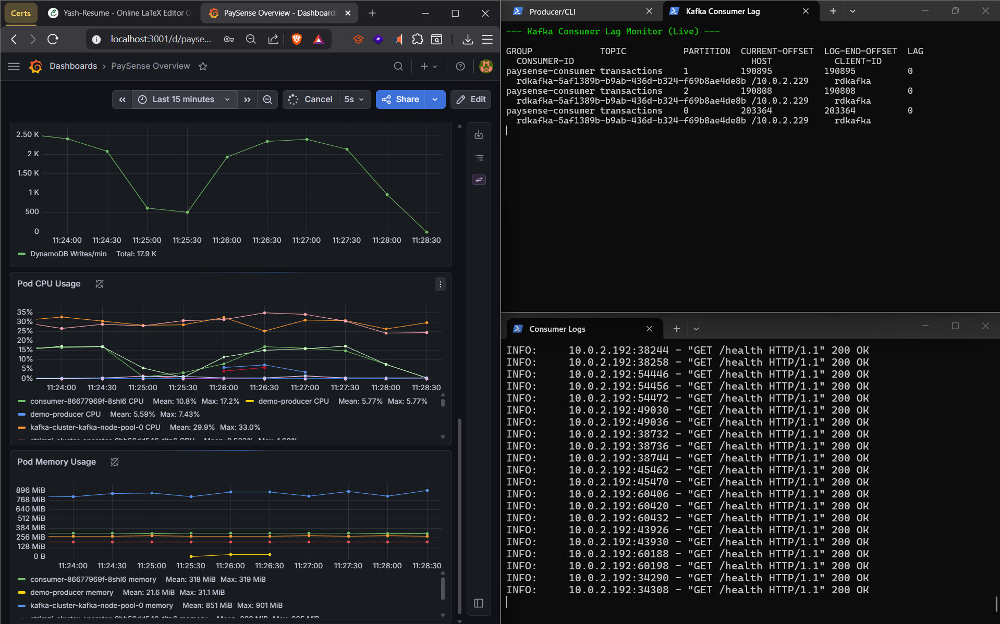

# PaySense — Real-time ML Fraud Detection at Scale

> **Production-grade, event-driven fraud detection system** built on AWS EKS with Kafka streaming, MLflow model versioning, GitOps deployments, and full-stack observability. Every component is provisioned via Infrastructure-as-Code using Terraform.


[](https://www.youtube.com/watch?v=0bPweooktf4)

> **Watch:** Full project walkthrough — architecture, live Kafka stress test, Grafana dashboards, and ArgoCD GitOps demo on a real AWS EKS cluster.

---

## Architecture



PaySense implements a **fully decoupled, event-driven pipeline** where each layer can scale and fail independently:

```text
Transaction Producers
        │
        ▼
Strimzi Kafka (topic: transactions, 3 partitions)
        │
        ▼
Consumer — ML Inference (Scikit-Learn via MLflow)
        │
        ├──▶ Amazon DynamoDB  (persist inference results)
        └──▶ Prometheus metrics (fraud rate, latency, throughput)

MLflow (S3 artifact store) ◀── Consumer loads model at startup

Prometheus ──▶ Grafana dashboards + PrometheusRule alerts
GitHub push ──▶ GitHub Actions (CI) ──▶ ECR ──▶ ArgoCD ──▶ EKS
```

**Why this architecture?**

| Property | How PaySense delivers it |
| --- | --- |
| **Decoupled** | Kafka buffers between producer and consumer — neither can crash the other |
| **Scalable** | Consumer replicas scale horizontally on Kafka consumer group lag |
| **Zero data loss** | Kafka persists events for 7 days; DynamoDB is serverless and fully managed |
| **Observable** | App metrics + infrastructure metrics + business KPIs in one Grafana pane |
| **Reproducible ML** | MLflow versions every model artifact; consumer pulls by registry URI |

---

## Tech Stack

| Layer | Technology |
| --- | --- |
| **Streaming** | Apache Kafka (Strimzi Operator on Kubernetes) |
| **ML Inference** | Python, Scikit-Learn (RandomForest), MLflow Model Registry |
| **Storage** | Amazon DynamoDB (serverless NoSQL) |
| **Container Registry** | Amazon ECR |
| **Orchestration** | Amazon EKS (Kubernetes 1.32), Helm |
| **Infrastructure as Code** | Terraform ≥ 1.7 (AWS provider ~5.0) |
| **GitOps** | ArgoCD — continuous delivery from GitHub |
| **CI/CD** | GitHub Actions (OIDC → ECR → Helm values auto-update) |
| **Observability** | Prometheus Operator, Grafana, kube-state-metrics, JMX Exporter |
| **Alerting** | PrometheusRule (fraud rate, p99 latency, consumer down, Kafka lag) |

---

## Infrastructure as Code — Terraform

All AWS infrastructure is defined in `infra/terraform/` and provisioned with zero manual console clicks.

### Remote State (Bootstrap)

State is stored remotely with locking to enable safe team collaboration:

```bash
# Bootstrap S3 bucket + DynamoDB lock table (one-time)
cd infra/terraform/bootstrap
terraform init && terraform apply
```

| Resource | Purpose |
| --- | --- |
| S3 bucket `paysense-terraform-state` | Stores `terraform.tfstate` encrypted at rest |
| DynamoDB table `paysense-terraform-locks` | Prevents concurrent `apply` conflicts |

```hcl
# infra/terraform/backend.tf
terraform {
  backend "s3" {
    bucket         = "paysense-terraform-state"
    key            = "eks/terraform.tfstate"
    region         = "us-east-1"
    dynamodb_table = "paysense-terraform-locks"
    encrypt        = true
  }
}
```

### Module Structure

```text
infra/terraform/
├── backend.tf          # S3 remote state + provider versions
├── variables.tf        # region, cluster_name, node_count, mlflow_bucket_name
├── outputs.tf          # cluster endpoint, ECR URLs, DynamoDB table, IRSA role
└── modules/
    ├── vpc/            # VPC, subnets, NAT gateway, route tables
    ├── eks/            # EKS cluster (terraform-aws-modules/eks ~20.0), managed node groups
    └── irsa/           # IAM Roles for Service Accounts (DynamoDB + S3 access)
```

### What Terraform Provisions

```bash
cd infra/terraform
terraform init
terraform plan
terraform apply   # ~15 minutes end-to-end
```

**Resources created:**

- **VPC** — dedicated VPC with public/private subnets across 2 AZs
- **EKS Cluster** — Kubernetes 1.32, 3× t3.small managed nodes
- **ECR Repositories** — `paysense-producer` and `paysense-consumer`
- **DynamoDB Table** — `transactions` with inference results
- **S3 Bucket** — `paysense-mlflow-artifacts` for model artifact storage
- **IRSA Role** — service account with least-privilege DynamoDB + S3 permissions

```bash
# After apply, configure kubectl
aws eks update-kubeconfig --name paysense-eks --region us-east-1
```

---

## AWS EKS Cluster



*The paysense-eks cluster running Kubernetes 1.32 with 3 t3.small worker nodes, all in Ready state. Provisioned entirely by Terraform — no manual console configuration.*

- **3-node managed node group** (t3.small) — balances cost and capacity for the demo workload
- **CPU usage:** 23–34% across nodes under live load
- **Memory usage:** 35–66%, with Kafka being the heaviest consumer (~850 MiB)
- **Extended support** until March 23, 2027

---

## GitOps — ArgoCD



*ArgoCD managing the full application stack. All three applications — paysense-consumer, paysense-kafka (Strimzi), and paysense-producer — are Healthy and Synced from the GitHub repository. Any push to `infra/helm/**` triggers an automatic reconciliation.*

ArgoCD watches the `infra/helm/` directory in this repository and automatically applies changes to the cluster:

| ArgoCD App | Helm Path | Manages |
| --- | --- | --- |
| `paysense-kafka` | `infra/helm/strimzi` | Strimzi KafkaCluster + topics |
| `paysense-producer` | `infra/helm/producer` | Producer deployment + service |
| `paysense-consumer` | `infra/helm/consumer` | Consumer deployment + service + ServiceMonitor |

---

## CI/CD Pipeline

GitHub Actions runs on every push to `main`/`master` for each service independently:

```text
git push origin master
        │
        ▼
GitHub Actions (ci-producer.yml / ci-consumer.yml)
  1. pytest — unit tests
  2. Configure AWS via OIDC (no long-lived credentials)
  3. docker build + push → Amazon ECR (tagged by git SHA)
  4. sed infra/helm/<service>/values.yaml → update image tag
  5. git push → triggers ArgoCD sync → rolling deploy on EKS
```

OIDC-based authentication means **no AWS credentials stored in GitHub Secrets** — only the IAM role ARN.

---

## Observability

### Grafana Dashboards



*Live dashboard during a 40 TPS load test. Top-left: transactions per second. Center: fraud detection rate at 10.5%. Bottom: classification latency (p50/p95/p99) all under 5ms — the ML inference is nearly instantaneous.*



*Extended dashboard view showing: DynamoDB writes peaking at 2.5K/min, Pod CPU (consumer ~17%, Kafka ~30%), Pod Memory (consumer ~318 MiB, Kafka ~850 MiB), and the Kafka Consumer Lag Monitor showing lag = 0 across all three partitions — the consumer is keeping up with the producer in real time.*

### Metrics Collected

| Source | Metrics |
| --- | --- |
| Producer pods | Transactions produced/sec, active connections |
| Consumer pods | Inference latency (p50/p95/p99), fraud rate %, DynamoDB write rate |
| Kafka (JMX Exporter) | Bytes in/out, consumer group lag, partition offsets |
| kube-state-metrics | Pod CPU, memory, restarts, HPA state |

### Alerting (PrometheusRule)

| Alert | Condition | Severity |
| --- | --- | --- |
| `HighFraudRate` | Fraud rate > 30% for 1 min | warning |
| `HighP99Latency` | p99 latency > 500ms | warning |
| `ConsumerDown` | Consumer pod count = 0 | critical |
| `KafkaLagHigh` | Consumer group lag > threshold | warning |

Alerts route to Slack, email, Discord, or webhook via Alertmanager.

---

## Live Demo

### Prerequisites

```bash
# Provision infrastructure
cd infra/terraform && terraform apply

# Configure kubectl
aws eks update-kubeconfig --name paysense-eks --region us-east-1

# Port-forward Grafana
kubectl port-forward -n monitoring svc/kube-prometheus-stack-grafana 3001:80
# Open http://localhost:3001 → PaySense Overview dashboard
```

### Baseline Traffic (20 TPS)

```bash
kubectl apply -f demo-producer-spec.json -n paysense
```

### Watch Consumer Processing

```bash
kubectl logs -f deployment/consumer -n paysense --tail 20 | Select-String "processed"
```

### Kafka Consumer Lag Monitor (Live)

```powershell
while($true) {
    $data = kubectl exec -n paysense kafka-cluster-kafka-node-pool-0 -- \
        /opt/kafka/bin/kafka-consumer-groups.sh \
        --bootstrap-server localhost:9092 \
        --group paysense-consumer --describe
    Clear-Host
    Write-Host "--- Kafka Consumer Lag Monitor (Live) ---" -ForegroundColor Green
    $data
    Start-Sleep -s 2
}
```

### Stress Test (80 TPS)

Edit `demo-producer-spec.json` → set `--tps 80`, then:

```bash
kubectl delete pod demo-producer -n paysense --now
kubectl apply -f demo-producer-spec.json -n paysense
```

Watch Kafka lag rise as the producer floods the cluster, demonstrating **backpressure management** — Kafka absorbs the spike while consumers scale to catch up.

### Trigger High-Fraud Alert

Set `--fraud-rate 0.45` in the spec. The Grafana fraud panel turns red and `HighFraudRate` alert fires — demonstrating **proactive, business-logic-aware monitoring**.

### Teardown

```powershell
# Scale down workloads (preserve cluster)
kubectl scale deployment producer --replicas=0 -n paysense
kubectl scale deployment consumer --replicas=0 -n paysense

# Full destroy (saves ~$5/day in EKS costs)
cd infra/terraform && terraform destroy
```

---

## Repository Structure

```text
PaySense2/
├── producer/                   # Transaction generator (Python, Click CLI, Prometheus metrics)
│   ├── src/producer/
│   └── tests/
├── consumer/                   # ML inference service (FastAPI, MLflow, DynamoDB writer)
│   ├── src/consumer/
│   └── tests/
├── infra/
│   ├── terraform/              # All AWS infrastructure (IaC)
│   │   ├── backend.tf          # S3 remote state
│   │   ├── variables.tf
│   │   ├── outputs.tf
│   │   └── modules/
│   │       ├── vpc/            # VPC + subnets
│   │       ├── eks/            # EKS cluster + node groups
│   │       └── irsa/           # IAM Roles for Service Accounts
│   └── helm/
│       ├── producer/           # Producer Helm chart
│       ├── consumer/           # Consumer Helm chart
│       ├── strimzi/            # KafkaCluster + topics
│       └── monitoring/         # ServiceMonitors, PrometheusRules, Grafana dashboards
├── .github/workflows/
│   ├── ci-producer.yml         # Test → ECR push → Helm values update
│   └── ci-consumer.yml
└── PROJECT_DEMO_GUIDE.md       # Full live demo script
```

---

## Key Design Decisions

**Strimzi over MSK** — Running Kafka on Kubernetes with Strimzi demonstrates operator pattern knowledge and keeps the demo fully self-contained within EKS. MSK would abstract away the operational complexity this project intentionally showcases.

**IRSA over node IAM roles** — Each pod gets a scoped IAM role via Kubernetes service account annotation. Consumer gets DynamoDB + S3 write. Producer gets no AWS permissions. Least-privilege at the pod level.

**MLflow direct file path over Registry API** — The consumer resolves the model from an S3 artifact path at startup, eliminating the MLflow tracking server as a runtime dependency. Model is pinned by artifact URI in the deployment manifest.

**GitOps image tag promotion** — GitHub Actions writes the new ECR image tag directly into `infra/helm/<service>/values.yaml` and commits it. ArgoCD detects the diff and rolls out the update. No external CD tooling needed beyond what's already in the cluster.

---

## Local Development

```bash
# Run full stack locally
docker compose up

# Run unit tests
cd producer && python -m pytest tests/ -v
cd consumer && python -m pytest tests/ -v

# Produce transactions locally
docker run paysense-producer --rows 1000 --fraud-rate 0.1 --tps 50 --mode kafka
```
